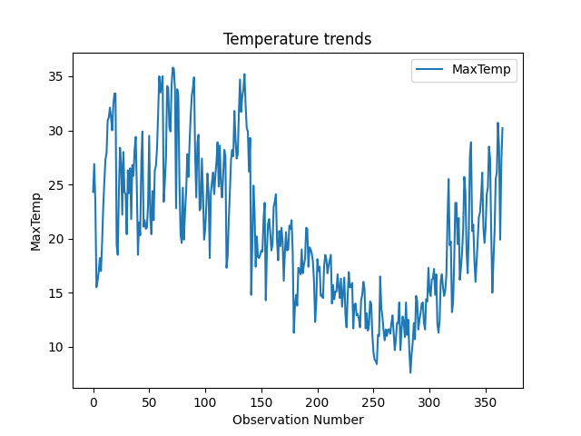
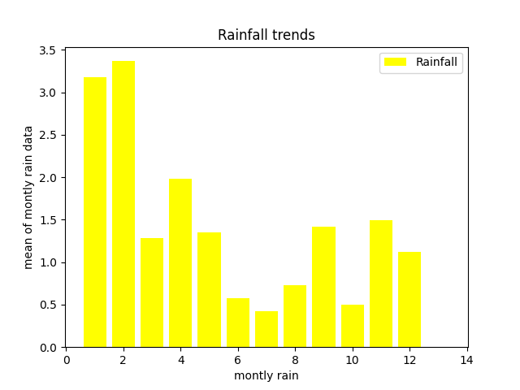

Here is a **single copy-paste README** that is **well-formatted, visually appealing**, and includes **plot images**:

```
# 🌦️ Weather Data Analysis with Python  

This project analyzes weather data from the [Kaggle Weather Dataset](https://www.kaggle.com/datasets/zaraavagyan/weathercsv) using **Pandas** and **Matplotlib**.  
It visualizes **temperature trends** and **rainfall patterns**, including aggregated rainfall for every 5 days.

---

## 📌 Features
✔️ Load and process weather data from CSV  
✔️ Plot **temperature trends** with line charts  
✔️ Plot **rainfall trends** with bar charts  
✔️ Group rainfall data into **5-day intervals** and calculate averages  
✔️ Save plots as images and display them in the report  

---

## 🖼️ Visualizations  

## 🌡️ Temperature Trend
<p align="center">
  
</p>

## 🌧️ Rainfall Trend
<p align="center">
  
</p>

---

## 🛠️ Technologies Used
- 🐍 Python 3.x  
- 📊 Pandas  
- 📈 Matplotlib  

---

## 🚀 How to Run the Project

### 1️⃣ Clone the Repository  
```

git clone [https://github.com/your-username/weather-analysis.git](https://github.com/your-username/weather-analysis.git)
cd weather-analysis

```

### 2️⃣ Install Dependencies  
```

pip install pandas matplotlib

```

### 3️⃣ Run the Script  
```

python weather\_tracker.py

```

✅ The script will show the plots and save them as `.png` images in the project folder.  

---

## 📊 Dataset  
The dataset used is from Kaggle:  
🔗 https://www.kaggle.com/datasets/zaraavagyan/weathercsv  

---

## 📄 License  
This project is open-source and available under the **MIT License**.

---

## ✨ Author  
👩‍💻 **Tanu Tater**  
🔗 [GitHub](https://github.com/tanutater)  
🔗 [LinkedIn](https://linkedin.com/in/tanu-tater-83a40a285)
```

---

### ✅ Why this is better?

* ✅ **Centered images** with `` tags (looks neat on GitHub)
* ✅ Uses **emojis and formatting** for a modern, attractive look
* ✅ Includes all instructions in one place
* ✅ Works with your saved plot files (`temperature_trend.png`, `rainfall_trend.png`)

